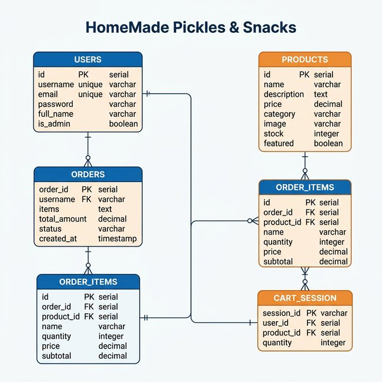
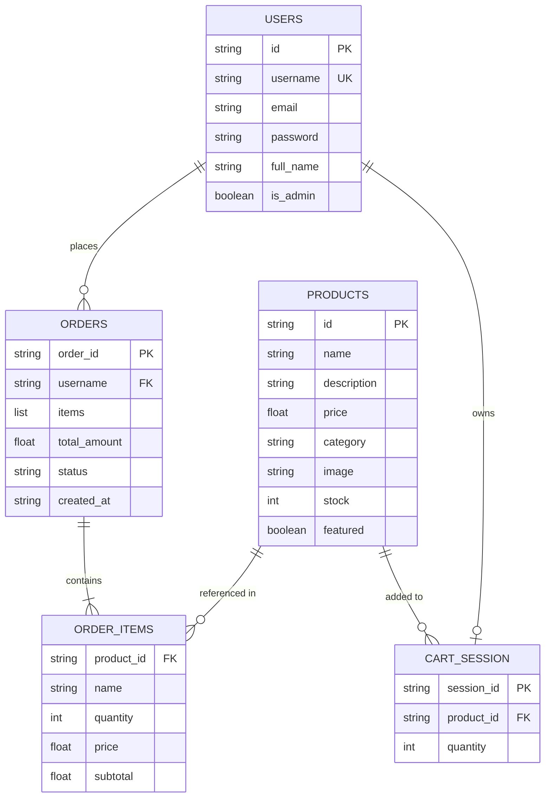
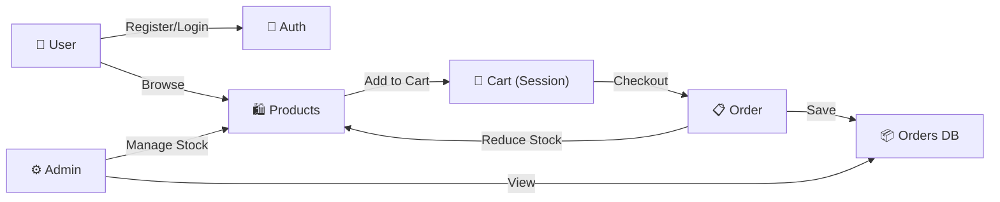

# 📊 ER Diagram — HomeMade Pickles & Snacks

## ER Diagram Image

## Entity Relationship Diagram (Mermaid)

## Data Flow

## Table Descriptions

| Entity | Storage | Key Fields |
|--------|---------|------------|
| **Users** | `USERS` dict / DynamoDB `HomemadePickles_Users` | `username` (PK), `password` (hashed), `is_admin` |
| **Products** | `PRODUCTS` dict / DynamoDB `HomemadePickles_Products` | `id` (PK), `name`, `price`, `stock`, `category` |
| **Orders** | `ORDERS` dict / DynamoDB `HomemadePickles_Orders` | `order_id` (PK), `username` (GSI), `items[]`, `total_amount` |
| **Cart** | Flask Session (filesystem) | `session_id`, `product_id → quantity` mapping |

## Relationships

| Relationship | Type | Description |
|-------------|------|-------------|
| User → Orders | One-to-Many | A user can place multiple orders |
| Order → Order Items | One-to-Many | Each order contains multiple items |
| Product → Order Items | One-to-Many | A product can appear in many orders |
| User → Cart | One-to-One | Each user session has one cart |
| Product → Cart | Many-to-Many | Multiple products can be in a cart |
